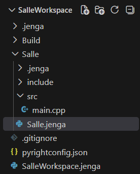

## **Contenu du fichier de projet de la salle (Salle.jenga) :**

```
from Jenga import *

with project("Salle"):
    windowedapp()
    language("C++")
    cppdialect("C++17")
    location(".")
    files(["src/**.cpp", "include/**.hpp"])
```

Ce code traduit la configuration projet suivante :

- Application avec fenêtre, excluant une console
- C++ version 17 choisi comme langage de programmation de l'application
- L'emplacement du projet est défini directement dans le dossier du workspace
- Jenga lit tous les fichiers .cpp et .hpp dans les dossiers ``src`` et ``include``, et jusqu'aux sous dossiers, à tous les niveaux de profondeur.

## **Sortie fournie par la commande ``jenga build`` :**

```
Loading workspace...

Configuration: Debug
Target:        Windows x86_64
Toolchain:     clang-mingw

Build Order (1 projects):
  1. Salle [WINDOWED_APP]


╔══════════════════════════════════════════════════════════════════════════════════════════════╗
║  Project: Salle                                                          Kind: WINDOWED_APP  ║
╚══════════════════════════════════════════════════════════════════════════════════════════════╝

ℹ Found 1 source file(s)
✓   [1/1] Compiled: main.cpp
ℹ Linking...
✓ Built: Build\Bin\Debug-Windows\Salle\Salle.exe

┌──────────────────────────────────────────────────────────────────────────────────────────────┐
│  ✓ Build Successful                                                             Time: 1.22s  │
└──────────────────────────────────────────────────────────────────────────────────────────────┘

════════════════════════════════════════════════════════════════════════════════
                                BUILD COMPLETED                                 
════════════════════════════════════════════════════════════════════════════════
Projects Built:  1/1
Time:           1.22s
Status:         ✓ SUCCESS
════════════════════════════════════════════════════════════════════════════════
```

La commande ``jenga build``, passée sans argument, compile le premier projet trouvé dans le workspace, et utilise les configurations de build par défaut (Debug, Windows comme système cible, clang-mingw comme toolchain (détecté automatiquement)).

La compilation se termine normalement et génère alors le fichier exécutable (Salle.exe). Le fichier code source (main.cpp) est disponible dans le même dossier que le présent fichier .md

### **Note : Arborescence du projet Salle :**


