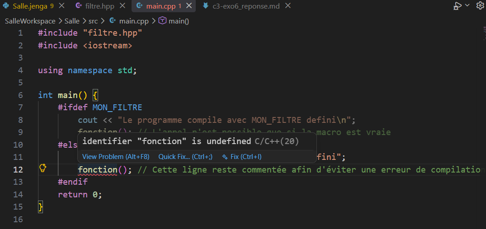

## **Le filtre qui ne s'active jamais : preuves**

Le but de cet exercice est de prouver qu'un filtre dont la condition est fausse sur une machine ne s'active jamais. Pour cela nous avons défini une fonction dans un fichier en-tête (`filtre.hpp`), qui n'est conservée par le préprocesseur que si le filtre `MON_FILTRE` est définie. 

L'ensemble des fichiers et le workspace sont disponibles, joints au présent .md

Nous avons mis à jour le fichier de projet comme demandé dans le rapport de correction, et il contient désormais le bloc :

```
with filter("system:Linux") :
   defines(["MON_FILTRE"])
```

### **Preuve que la condition est fausse : Compilation sur Windows**

La compilation fonctionne (nous avons commenté la ligne d'appel à la fonction afin d'éviter une erreur et de voir le message affiché), l'exécution affiche `Le programme compile sans MON_FILTRE defini`.

La preuve que la fonction n'est pas appliquée est claire : Lorsque nous décommentons l'appel à la fonction, l'éditeur de code nous signale directement, et la compilation le confirme :



```
══════════════════════════════════════════════════════════════════════════════════════════════╗
║                                 Compilation Error: main.cpp                                  ║
╠══════════════════════════════════════════════════════════════════════════════════════════════╣
║ C:\Users\Kindson\Desktop\Travaux\github\Teguis\ani-4087\chapitre-02\exo6-le_filtre_qui_ne_s_ ║
║ active_jamais\SalleWorkspace\Salle\src\main.cpp:12:9: error: use of undeclared identifier    ║
║ 'fonction'                                                                                   ║
║ 12 |         fonction(); // Cette ligne reste commentée afin d'éviter une erreur de          ║
║ compilation                                                                                  ║
║       |         ^~~~~~~~                                                                     ║
║ 1 error generated.
```

Cette erreur prouve que le préprocesseur a bien retiré le bloc de définition de la fonction, elle n'existe absolument pas dans le code compilé. Ce qui est normal puisque le filtre `MON_FILTRE` n'est activé que si le système concerné est linux.

### **Preuve que la condition rendue vraie l'est**

Ici, nous allons rendre la condition vraie : nous allons remplacer `Linux` par `Windows` dans l'instruction `with filter()`. L'exécution affiche, conformément à ce qui est prévu si la condition est vraie :
```
Le programme compile avec MON_FILTRE defini
```
Puis :
```
Cette fonction ne compile que si MON_FILTRE existe
```

Cette fois, la fonction est bien présente et appelable. Le filtre qui la rend visible est valable, et donc le compilateur y a accès normalement.

Comme mentionné dans le précédent rendu, le préprocesseur ne fait aucune différence entre une macro définie naturellement par le compilateur sous un système, et une macro forcée dans un programme. Les deux sont traitées de façon identique. Nous revenons sur cette remarque car le rapport de correction nous a fait comprendre sa profondeur, et nous tenons à en remercier l'encadrant : Le choix des noms de macro ne se fait pas au hasard, les macros avec des noms de systèmes sont réservés et posés par le compilateur, et sur des programmes lourds, les forcer sur un système incompatible provoque des erreurs incompréhensibles qui prendront énormément de temps à être comprises.