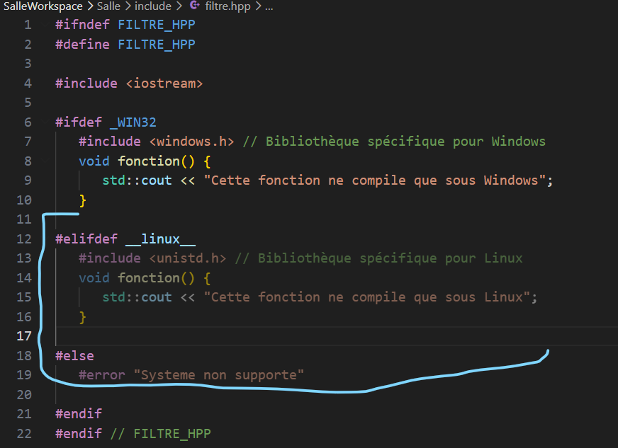
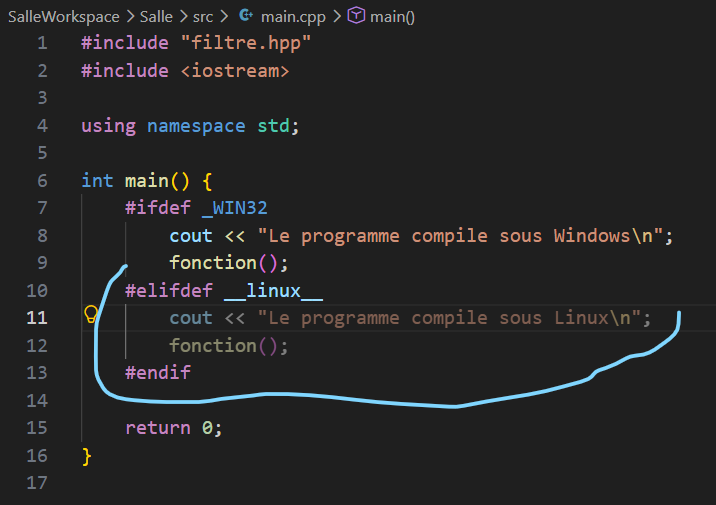

## **Filtres pour deux systèmes différents**

Nous avons écrit deux filtres pour Windows et pour Linux, chacun contenant ses bibliothèques. Dans le fichier en-tête `filtre.hpp`, nous utilisons les macros `_WIN32` et `__Linux__` pour encadrer les fonctions correspondantes. Ainsi sous Windows seul le bloc entouré par la macro `_win32` sera compilé, et sous Linux seul le bloc entouré par `__Linux__` sera compilé. Chaque bloc contient un message qui prouve que c'est lui qui est lu.

La bibliothèque appelée sous Windows est `windows.h`, et sous linux c'est `unistd.h`. Les fichiers sont disponibles dans le workspace associé au présent fichier .md


La compilation sous Windows produit les messages :

```
Le programme compile sous Windows
Cette fonction ne compile que sous Windows
```

Cependant nous n'avons pas pu tester son fonctionnement sous Linux car nous n'avons pas accès à ce système. Néanmoins le comportement de l'éditeur de code laisse supposer (nous ne disns pas que cela sera forcément vrai) que le programme affichera, sans modifications, le comportement attendu sous Linux : il masque automatiquement les blocs entourés par la macro linux




Ces images laissent supposer que sous Linux, les blocs concernant Windows seront masqués de la même manière et les messages en sortie seront :

```
Cette fonction ne compile que sous Linux
Le programme compile sous Linux
```

Encore une fois, nous précisons que ce n'est qu'une supposition et que sans vérification concrète nous ne pouvons pas affirmer que cela se passera ainsi.

### **Que peut-on interpréter ?**

- Dans la portabilité, le préprocesseur a une gestion de code spécifique au système. Le C++ est un langage compilé directement vers le code machine du système hôte. On ne peut pas appeler une bibliothèque Linux sous Windows sans émulation, pareil dans l'autre sens.

- Les directives #ifdef, #elifdef, #else et #endif agissent avant la compilation. Le code non destiné au système hôte est ignoré par le compilateur, ce qui évite les erreurs de syntaxe ou de symboles manquants.

- Écrire du code pour deux ou plusieurs systèmes tout en travaillant sur un seul expose aux erreurs. Sans vérification croisée ou sans intégration continue sur les deux systèmes, un projet multiplateforme se casse facilement.
