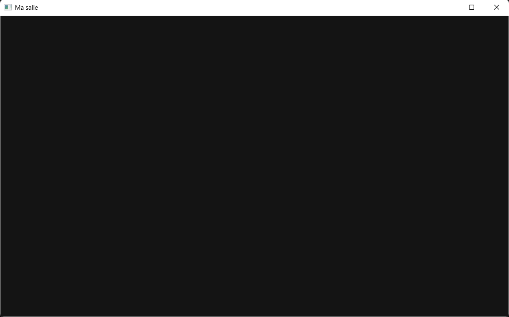

# **La fenêtre Nue**

Cet exercice posait les fondations de la création d'une application fenetrée avec NKWindow. Nous décrivons ici comment nous avons procédé pour mettre sur pied les outils nécessaires à la création de la fenêtre. Tous les fichiers de workspace et de projet sont rendus avec ce markdown

## **Etape 1 : Cloner le dépôt Nkentseu depuis github**

Nous avions déjà le dépôt Nkentseu cloné, mais pas avec les sous modules associés aux modules de Nkentseu (clonage classique avec `git clone`)
Afin de s'assurer que rien ne manquera lorsqu'il faudra construire les modules à utiliser, nous avons refait le clonage total du dépôt et de ses sous modules. Pour ce faire nous avons exécuté la commande `git clone --recurse-submodules https://github.com/Rihen-Universe/Nkentseu.git`.

Le dépôt Nkentseu a été cloné au chemin `C:/Rihen/`, aux côtés du dépôt Jenga. A cause de la qualité de la connexion internet que nous utilisons cette opération a dû etre effectuée 4 fois et nous a pris plus de deux heures avant d'être finalement réussie.

## **Etape 2 : Construire les modules NKWindow et NKEvent**

Au début de cette étape, nous avons commis une erreur : celle de construire TOUS les modules du moteur. Nous avons lancé la commande `jenga build`, qui a lancé la compilation de tous les 256 modules contenus dans le dossier Nkentseu. Et cette opération nous menait plusieurs fois à des erreurs de compilation sur des modules différents à chaque fois :

- Première tentative :

```
╔══════════════════════════════════════════════════════════════════════════════════════════════╗
║                                Compilation Error: Link Failed                                ║
╠══════════════════════════════════════════════════════════════════════════════════════════════╣
║ C:/msys64/ucrt64/lib\libstdc++.a(bad_alloc.o): duplicate section                             ║
║ `.rdata$_ZTSSt9exception[_ZTSSt9exception]' has different size                               ║
║ C:/msys64/ucrt64/lib\libstdc++.a(bad_alloc.o): duplicate section                             ║
║ `.rdata$_ZTSSt9bad_alloc[_ZTSSt9bad_alloc]' has different size                               ║
║ C:/msys64/ucrt64/lib\libstdc++.a(bad_alloc.o): duplicate section                             ║
║ `.rdata$_ZTISt9bad_alloc[_ZTISt9bad_alloc]' has different size                               ║
║ C:/msys64/ucrt64/lib\libstdc++.a(eh_alloc.o): duplicate section                              ║
║ `.rdata$_ZTSSt9exception[_ZTSSt9exception]' has different size                               ║
║ C:/msys64/ucrt64/lib\libstdc++.a(eh_exception.o): duplicate section                          ║
║ `.rdata$_ZTSSt9exception[_ZTSSt9exception]' has different size                               ║
║ C:/msys64/ucrt64/lib\libstdc++.a(eh_personality.o): duplicate section                        ║
║ `.rdata$_ZTSSt9exception[_ZTSSt9exception]' has different size                               ║
║ C:/msys64/ucrt64/lib\libstdc++.a(guard.o): duplicate section                                 ║
║ `.rdata$_ZTSSt9exception[_ZTSSt9exception]' has different size                               ║
║ C:/msys64/ucrt64/lib\libstdc++.a(vterminate.o): duplicate section                            ║
║ `.rdata$_ZTSSt9exception[_ZTSSt9exception]' has different size                               ║
║ C:/msys64/ucrt64/lib\libstdc++.a(locale.o): duplicate section                                ║
║ `.rdata$_ZTSSt9exception[_ZTSSt9exception]' has different size                               ║
║ C:/msys64/ucrt64/lib\libstdc++.a(stdexcept.o): duplicate section                             ║
║ `.rdata$_ZTSSt9exception[_ZTSSt9exception]' has different size                               ║
║ C:/msys64/ucrt64/lib\libstdc++.a(stdexcept.o): duplicate section                             ║
║ `.rdata$_ZTSSt13runtime_error[_ZTSSt13runtime_error]' has different size                     ║
║ C:/msys64/ucrt64/lib\libstdc++.a(stdexcept.o): duplicate section                             ║
║ `.rdata$_ZTISt13runtime_error[_ZTISt13runtime_error]' has different size                     ║
║ C:/msys64/ucrt64/lib\libstdc++.a(functexcept.o): duplicate section                           ║
║ `.rdata$_ZTSSt9exception[_ZTSSt9exception]' has different size                               ║
║ C:/msys64/ucrt64/lib\libstdc++.a(functexcept.o): duplicate section                           ║
║ `.rdata$_ZTSSt9bad_alloc[_ZTSSt9bad_alloc]' has different size                               ║
║ C:/msys64/ucrt64/lib\libstdc++.a(functexcept.o): duplicate section                           ║
║ `.rdata$_ZTISt9bad_alloc[_ZTISt9bad_alloc]' has different size                               ║
║ C:/msys64/ucrt64/lib\libstdc++.a(functexcept.o): duplicate section                           ║
║ `.rdata$_ZTSSt13runtime_error[_ZTSSt13runtime_error]' has different size                     ║
║ C:/msys64/ucrt64/lib\libstdc++.a(functexcept.o): duplicate section                           ║
║ `.rdata$_ZTISt13runtime_error[_ZTISt13runtime_error]' has different size                     ║
║ C:/msys64/ucrt64/lib\libstdc++.a(functional.o): duplicate section                            ║
║ `.rdata$_ZTSSt9exception[_ZTSSt9exception]' has different size                               ║
║ C:/msys64/ucrt64/lib\libstdc++.a(locale_init.o): duplicate section                           ║
║ `.rdata$_ZTSSt9exception[_ZTSSt9exception]' has different size                               ║
║ C:/msys64/ucrt64/lib\libstdc++.a(random.o): duplicate section                                ║
║ `.rdata$_ZTSSt9exception[_ZTSSt9exception]' has different size                               ║
║ C:/msys64/ucrt64/lib\libstdc++.a(random.o): duplicate section                                ║
║ `.rdata$_ZTSSt13runtime_error[_ZTSSt13runtime_error]' has different size                     ║
║ C:/msys64/ucrt64/lib\libstdc++.a(random.o): duplicate section                                ║
║ `.rdata$_ZTISt13runtime_error[_ZTISt13runtime_error]' has different size                     ║
║ C:/msys64/ucrt64/lib\libstdc++.a(system_error.o): duplicate section                          ║
║ `.rdata$_ZTSSt9exception[_ZTSSt9exception]' has different size                               ║
║ C:/msys64/ucrt64/lib\libstdc++.a(system_error.o): duplicate section                          ║
║ `.rdata$_ZTSSt13runtime_error[_ZTSSt13runtime_error]' has different size                     ║
║ C:/msys64/ucrt64/lib\libstdc++.a(system_error.o): duplicate section                          ║
║ `.rdata$_ZTISt13runtime_error[_ZTISt13runtime_error]' has different size                     ║
║ C:/msys64/ucrt64/lib\libstdc++.a(bad_array_new.o): duplicate section                         ║
║ `.rdata$_ZTSSt9exception[_ZTSSt9exception]' has different size                               ║
║ C:/msys64/ucrt64/lib\libstdc++.a(bad_array_new.o): duplicate section                         ║
║ `.rdata$_ZTSSt9bad_alloc[_ZTSSt9bad_alloc]' has different size                               ║
║ C:/msys64/ucrt64/lib\libstdc++.a(bad_array_new.o): duplicate section                         ║
║ `.rdata$_ZTISt9bad_alloc[_ZTISt9bad_alloc]' has different size                               ║
║ C:/msys64/ucrt64/lib\libstdc++.a(bad_cast.o): duplicate section                              ║
║ `.rdata$_ZTSSt9exception[_ZTSSt9exception]' has different size                               ║
║ C:/msys64/ucrt64/lib\libstdc++.a(bad_typeid.o): duplicate section                            ║
║ `.rdata$_ZTSSt9exception[_ZTSSt9exception]' has different size                               ║
║ C:/msys64/ucrt64/lib\libstdc++.a(eh_aux_runtime.o): duplicate section                        ║
║ `.rdata$_ZTSSt9exception[_ZTSSt9exception]' has different size                               ║
║ C:/msys64/ucrt64/lib\libstdc++.a(eh_aux_runtime.o): duplicate section                        ║
║ `.rdata$_ZTSSt9bad_alloc[_ZTSSt9bad_alloc]' has different size                               ║
║ C:/msys64/ucrt64/lib\libstdc++.a(eh_aux_runtime.o): duplicate section                        ║
║ `.rdata$_ZTISt9bad_alloc[_ZTISt9bad_alloc]' has different size                               ║
║ C:/msys64/ucrt64/lib\libstdc++.a(cxx11-ios_failure.o): duplicate section                     ║
║ `.rdata$_ZTSSt9exception[_ZTSSt9exception]' has different size                               ║
║ C:/msys64/ucrt64/lib\libstdc++.a(cxx11-ios_failure.o): duplicate section                     ║
║ `.rdata$_ZTSSt13runtime_error[_ZTSSt13runtime_error]' has different size                     ║
║ C:/msys64/ucrt64/lib\libstdc++.a(cxx11-ios_failure.o): duplicate section                     ║
║ `.rdata$_ZTISt13runtime_error[_ZTISt13runtime_error]' has different size                     ║
║ C:/msys64/ucrt64/lib\libstdc++.a(ios_failure.o): duplicate section                           ║
║ `.rdata$_ZTSSt9exception[_ZTSSt9exception]' has different size                               ║
║ C:/msys64/ucrt64/bin/ld:                                                                     ║
║ C:\Rihen\Nkentseu\Build\Obj\Debug-Windows\NKXRDemo\src_NKXRDemo_main.obj: in function        ║
║ `nkmain(nkentseu::NkEntryState const&)':                                                     ║
║ C:\Rihen\Nkentseu\Applications\NKXRDemo\src\NKXRDemo/main.cpp:880:(.text+0x4a54): undefined  ║
║ reference to `nkentseu::NkVulkanDevice::GetVkImage(unsigned long long) const'                ║
║ C:/msys64/ucrt64/bin/ld:                                                                     ║
║ C:\Rihen\Nkentseu\Applications\NKXRDemo\src\NKXRDemo/main.cpp:882:(.text+0x4b04): undefined  ║
║ reference to `nkentseu::NkVulkanDevice::GetVkImage(unsigned long long) const'                ║
║ C:/msys64/ucrt64/bin/ld:                                                                     ║
║ C:\Rihen\Nkentseu\Applications\NKXRDemo\src\NKXRDemo/main.cpp:886:(.text+0x4bb4): undefined  ║
║ reference to `nkentseu::NkVulkanDevice::GetVkImage(unsigned long long) const'                ║
║ C:/msys64/ucrt64/bin/ld:                                                                     ║
║ C:\Rihen\Nkentseu\Applications\NKXRDemo\src\NKXRDemo/main.cpp:888:(.text+0x4c64): undefined  ║
║ reference to `nkentseu::NkVulkanDevice::GetVkImage(unsigned long long) const'                ║
║ clang++: error: linker command failed with exit code 1 (use -v to see invocation)            ║
╚══════════════════════════════════════════════════════════════════════════════════════════════╝
✗ Link failed: Build\Bin\Debug-Windows\NKXRDemo\NKXRDemo.exe

┌──────────────────────────────────────────────────────────────────────────────────────────────┐
│  ✗ Build Failed                                                                 Time: 6.84s  │
│ Errors: 5  | Failed files: 1                                                                 │
└──────────────────────────────────────────────────────────────────────────────────────────────┘

════════════════════════════════════════════════════════════════════════════════
                                  BUILD FAILED
════════════════════════════════════════════════════════════════════════════════
Projects Built:  101/256
Failed:         1
Not reached:    154  (arret au premier echec — voir --keep-going)
Errors:         5
Warnings:       4
Time:           2m10.2s
Status:         ✗ FAILURE
════════════════════════════════════════════════════════════════════════════════

Echecs (1) — a corriger :
  ✗ NKXRDemo
```

- Deuxième tentative :

```
╔══════════════════════════════════════════════════════════════════════════════════════════════╗
║                                Compilation Error: Link Failed                                ║
╠══════════════════════════════════════════════════════════════════════════════════════════════╣
║ C:/msys64/ucrt64/bin/ld: cannot find -lvulkan-1: No such file or directory                   ║
║ C:/msys64/ucrt64/bin/ld: have you installed the static version of the vulkan-1 library ?     ║
║ clang++: error: linker command failed with exit code 1 (use -v to see invocation)            ║
╚══════════════════════════════════════════════════════════════════════════════════════════════╝
✗ Link failed: Build\Bin\Debug-Windows\NkDemoCurseur\NkDemoCurseur.exe

┌──────────────────────────────────────────────────────────────────────────────────────────────┐
│  ✗ Build Failed                                                                 Time: 0.49s  │
│ Errors: 1  | Failed files: 1                                                                 │
└──────────────────────────────────────────────────────────────────────────────────────────────┘

════════════════════════════════════════════════════════════════════════════════
                                  BUILD FAILED
════════════════════════════════════════════════════════════════════════════════
Projects Built:  99/256
Failed:         1
Not reached:    156  (arret au premier echec — voir --keep-going)
Errors:         1
Warnings:       200
Time:           1m59.2s
Status:         ✗ FAILURE
════════════════════════════════════════════════════════════════════════════════

Echecs (1) — a corriger :
  ✗ NkDemoCurseur
```

- Troisième tentative :

```
╔══════════════════════════════════════════════════════════════════════════════════════════════╗
║                                Compilation Error: Link Failed                                ║
╠══════════════════════════════════════════════════════════════════════════════════════════════╣
║ C:/msys64/ucrt64/bin/ld: cannot find -lvulkan-1: No such file or directory                   ║
║ C:/msys64/ucrt64/bin/ld: have you installed the static version of the vulkan-1 library ?     ║
║ clang++: error: linker command failed with exit code 1 (use -v to see invocation)            ║
╚══════════════════════════════════════════════════════════════════════════════════════════════╝
✗ Link failed: Build\Bin\Release-Windows\NkRef\NkRef.exe

┌──────────────────────────────────────────────────────────────────────────────────────────────┐
│  ✗ Build Failed                                                                 Time: 9.22s  │
│ Errors: 1  | Failed files: 1                                                                 │
└──────────────────────────────────────────────────────────────────────────────────────────────┘

════════════════════════════════════════════════════════════════════════════════
                                  BUILD FAILED
════════════════════════════════════════════════════════════════════════════════
Projects Built:  88/256
Failed:         1
Not reached:    167  (arret au premier echec — voir --keep-going)
Errors:         1
Warnings:       71
Time:           12m59.2s
Status:         ✗ FAILURE
════════════════════════════════════════════════════════════════════════════════

Echecs (1) — a corriger :
  ✗ NkRef
```

Après ces erreurs une idée nous est venue : lancer la commande de construction du kit NKWindow pour voir ce qu'elle nous dit, et si elle pourrait nous permettre de savoir quoi faire. Et cela a porté ses fuits :

```
C:\Rihen\Nkentseu>jenga kit --target NKWindow --config all --platform Windows --output Kit

╔══════════════════════════════════════════════════════════════════╗
║                                                                  ║
║                ██╗███████╗███╗   ██╗ ██████╗  █████╗             ║
║                ██║██╔════╝████╗  ██║██╔════╝ ██╔══██╗            ║
║                ██║█████╗  ██╔██╗ ██║██║  ███╗███████║            ║
║           ██   ██║██╔══╝  ██║╚██╗██║██║   ██║██╔══██║            ║
║           ╚█████╔╝███████╗██║ ╚████║╚██████╔╝██║  ██║            ║
║            ╚════╝ ╚══════╝╚═╝  ╚═══╝ ╚═════╝ ╚═╝  ╚═╝            ║
║                                                                  ║
║             Multi-platform C/C++ Build System v2.8.0             ║
║                                                                  ║
╚══════════════════════════════════════════════════════════════════╝

[NKCode] ATTENTION : aucun wheel Jenga trouve (dist/*.whl) -> le paquet n'aura PAS de Jenga embarque, et les boutons Construire/Executer seront inoperants. Produisez-le avec ./cri.sh dans le depot Jenga.
============================= Jenga kit - Nkentseu =============================


Ce que le kit va contenir
------------------------------------------------------------
Nom          : NkentseuKit
Dossier      : C:\Rihen\Nkentseu\Kit
Modules      : 11
Ordre de lien: NKWindow NKEvent NKFileSystem NKTime NKLogger NKMath NKThreading NKContainers NKMemory NKCore NKPlatform
Configurations : Debug, Release
Plateformes    : Windows


Des bibliotheques n'ont pas ete construites :
   NKPlatform (Debug-Windows)
   NKCore (Debug-Windows)
   NKMemory (Debug-Windows)
   NKContainers (Debug-Windows)
   NKThreading (Debug-Windows)
   NKMath (Debug-Windows)
   NKLogger (Debug-Windows)
   NKTime (Debug-Windows)
   NKFileSystem (Debug-Windows)
   NKEvent (Debug-Windows)
   NKWindow (Debug-Windows)
   NKPlatform (Release-Windows)
   NKCore (Release-Windows)
   NKMemory (Release-Windows)
   NKContainers (Release-Windows)
   NKThreading (Release-Windows)
   NKMath (Release-Windows)
   NKLogger (Release-Windows)
   NKTime (Release-Windows)
   NKFileSystem (Release-Windows)
   ... et 2 autres
Construisez-les d'abord, par exemple :
   jenga build --target NKWindow --config Debug
   jenga build --target NKWindow --config Release
Ou relancez avec --allow-missing pour un kit partiel.
```

Cela nous a permis de comprendre que nous n'avions besoin que de construire NKWindow et NKEvent en Debug et Release pour avoir un kit prêt (les autres modules listés se constuisent automatiquement avec la construction de ces deux là). La construction de ces deux modules s'est faite avec les commandes :

```
jenga build --target NKWindow --config Debug
jenga build --target NKWindow --config Release
jenga build --target NKEvent --config Release
jenga build --target NKEvent --config Debug
```

La construction s'est terminée normalement et lorsque nous avons relancé la commande `jenga kit --target NKWindow --config all --platform Windows --output Kit` pour construire le kit, tout s'est bien passé. Voici un extrait du retour de construction du kit :

```
============================= Jenga kit - Nkentseu =============================


Ce que le kit va contenir
------------------------------------------------------------
Nom          : NkentseuKit
Dossier      : C:\Rihen\Nkentseu\Kit
Modules      : 11
Ordre de lien: NKWindow NKEvent NKFileSystem NKTime NKLogger NKThreading NKMath NKContainers NKMemory NKCore NKPlatform
Configurations : Debug, Release
Plateformes    : Windows


Kit ecrit
------------------------------------------------------------
Cible             Bibliotheques   Dossier
=====================================================
Debug-Windows     11              lib/Debug-Windows
Release-Windows   11              lib/Release-Windows

En-tetes copies : 300
Taille du kit   : 18.1 Mo

Kit pret : C:\Rihen\Nkentseu\Kit

Pour l'utiliser depuis un autre workspace :

   with workspace("MonJeu"):
      useconfig("NkentseuKit/NkentseuKit.jenga")

      with project("Jeu"):
         consoleapp()
         files(["src/**.cpp"])
         usenkentseukit()
```

Toute cette étape 2 nous a pris plus d'une demi-journée de réflexion et de réalisation.

## **Etape 3 : Inclusion du kit dans les fichiers du workspace et du projet**

Avant de créer l'application finale, nous devions d'abord, comme indiqué dans le retour de commande précédent, inclure le kit dans les fichiers `SalleWorkspace.jenga` et `Salle.jenga`. Nous avons ajouté les lignes suivantes :

- Dans `SalleWorkspace.jenga` (bloc `with project("Salle"):`) : `useconfig("C:/Rihen/Nkentseu/Kit/NKentseuKit.jenga")`
- Dans `Salle.jenga` (bloc `with workspace("SalleWorkspace"):`) : `usenkentseukit()`

La séparation effectuée entre notre workspace et le kit s'explique pour deux raisons : 
- Elle permet d'avoir un seul kit partagé par plusieurs exercices que nous allons rendre, et donc évite d'inclure les fichiers lourds dans un seul dépôt par exercice.
- Elle évite surtout de publier des éléments de la propriété de Rihen dans nos travaux comme s'ils étaient conçus par nous même.

## **Etape 4 : Création de la fenêtre et exécution**

Le programme de 15 lignes fourni dans le cours a été recopié dans le fichier `main.cpp` (après appel des modules NKWindow et NKMain), dans le point d'entrée `nkmain()`. Le code complet est disponible dans le fichier. la construction avec jenga build s'est terminée normalement, en 5.05 secondes. L'exécution affiche une fenêtre noire qu'on peut minimiser, redimensionner, mais pas fermer proprement (ce qui est normal car le code écrit ne gère pas l'évènement de clic sur la croix de fermeture).



Tout l'ensemble du processus de réalisation de cet exercice nous aura pris au final un peu plus de 15 heures de temps.
