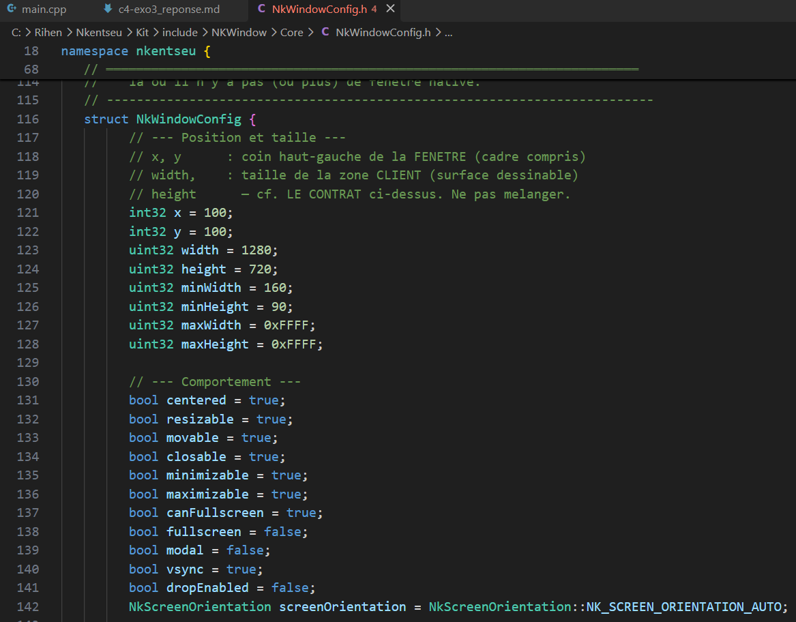
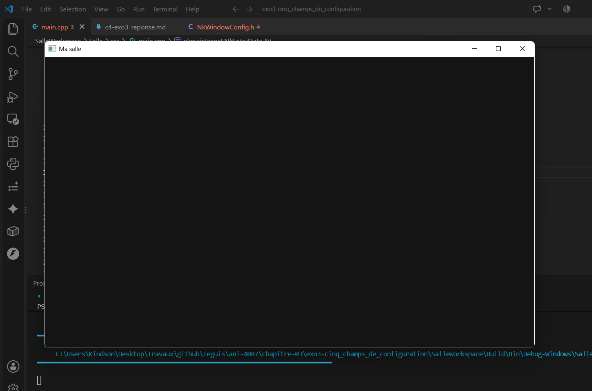
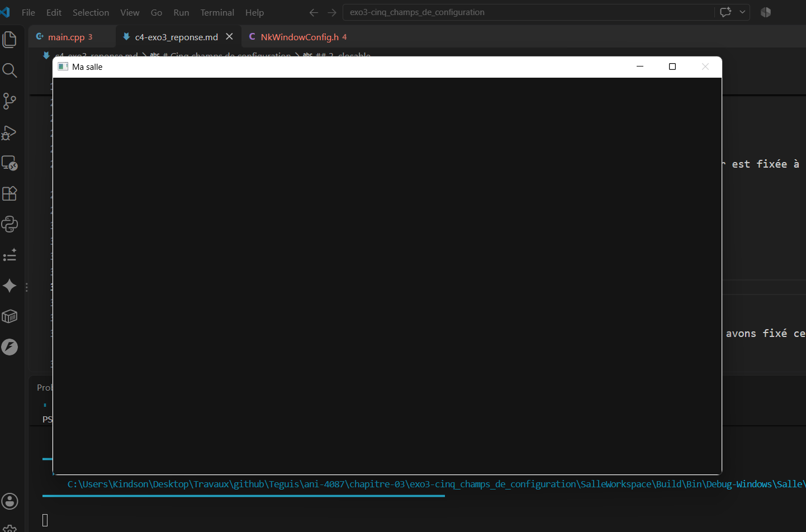
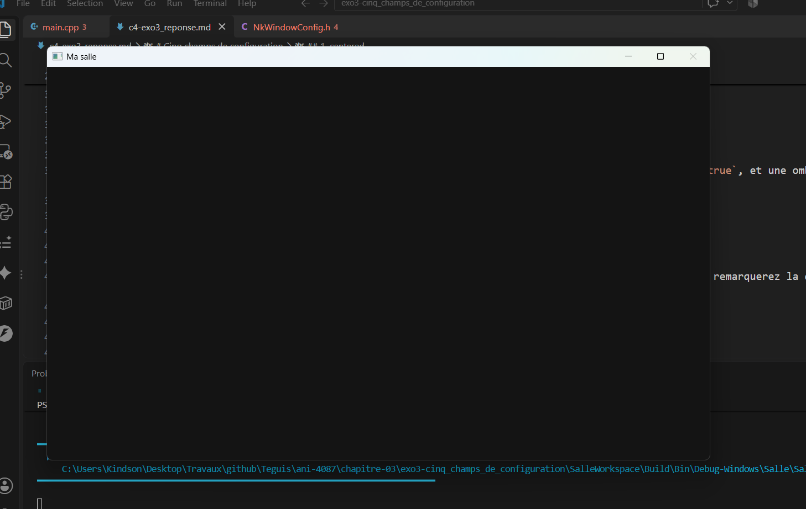
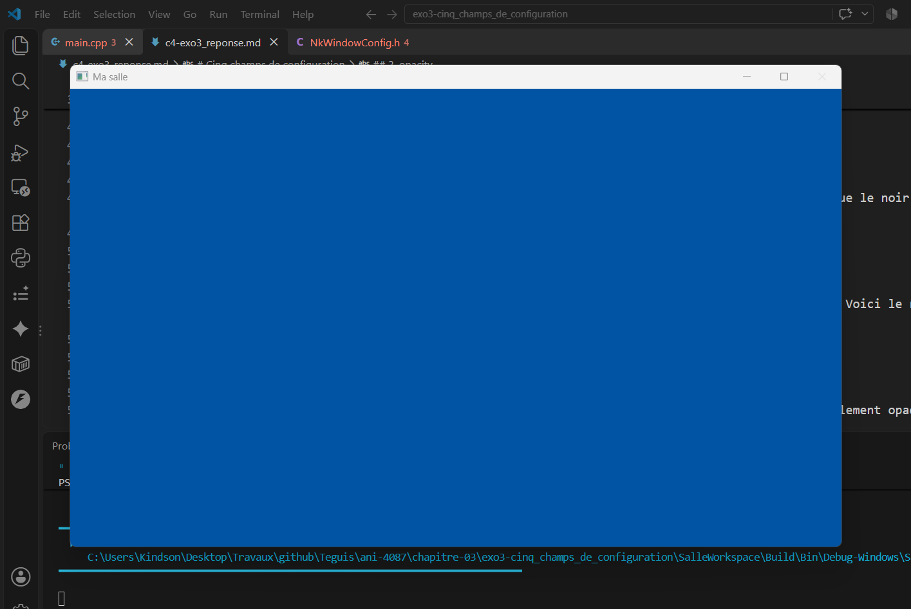
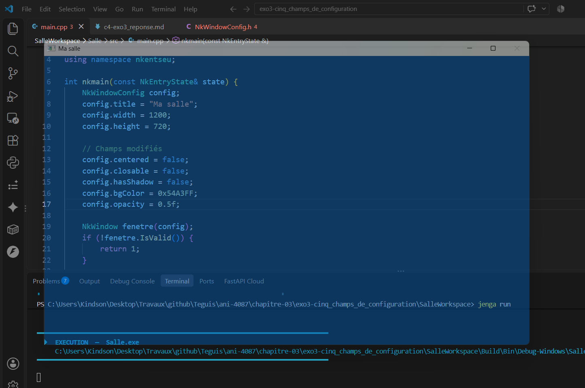

# **Cinq champs de configuration**

Nous avons choisi dans `NkWindowConfig.h` (accessible depuis `Nkentseu/Kit/include/NKWindow/Core/`) cinq champs de configuration de la fenêtre. Ces champs sont visibles dans la déclaration de la structure `NkWindowConfig`, à partir de la ligne 116 du fichier. 



Nous avons choisi les champs suivants :
- centered
- closable
- hasShadow
- bgColor
- opacity

Voici nos attentes et nos observations :

## **1. centered**
Il définit si la fenêtre est centrée par rapport à l'écran ou non. Par défaut, sa valeur est fixée à `true`. Nous avons passé cette valeur à `false` et nous nous attendions à voir une fenêtre qui nait en étant non centrée :

```
config.centered = false;
```

Le résultat obtenu confirme cette attente : la fenêtre nait alignée vers la gauche



## **2. closable**
Ce champ définit si la fenêtre peut être fermée via le bouton de fermeture (croix). Par défaut, sa valeur est fixée à `true`. Nous avons fixée cette valeur à `false` et nous nous attendions à voir le bouton de croix être masqué :

```
config.closable = false;
```

Le résultat obtenu confirme cette attente : le bouton de fermeture a bien été masqué.



## **3. hasShadow**
Ce champ définit si la fenêtre possède une ombre ou non (aux bords). Par défaut, sa valeur est fixée à `true`, et une ombre blanche apparaît. Nous avons fixé cette valeur à `false`, et nous nous attendions à ne plus pouvoir l'ombre :

```
config.hasShadow = false;
```

Le résultat obtenu confirme cette attente : l'ombre blanche aux bords de la fenêtre a bien disparu (vous remarquerez la différence au niveau des bordures, par rapport à la capture précédente).



## **4. bgColor**

C'est le champ qui définit la couleur de fond de l'application. Nous avons appliquée une couleur autre que le noir (`0x141414FF`) choisi par défaut :
```
config.bgColor = 0x54A3FF;
```

En modifiant ce champ , nous nous attendions à voir la couleur de fond de l'application changée en bleu. Voici le résultat obtenu (conforme à nos attentes) :



## **5. opacity**

C'est le champ qui définit le niveau d'opacité de la fenêtre. Par défaut sa valeur est fixée à 1.0 (totalement opaque). Nous avons défini sa valeur à 0.5 :

```
config.opacity = 0.5f;
```

Nous nous attendions à voir de la transparence sur la fenêtre. Le résultat obtenu a confirmé nos attentes :



**Note :** Toutes ces modifications de champs ont été faites dans notre code, dans `main.cpp`, pas dans `NkWindowConfig.h`