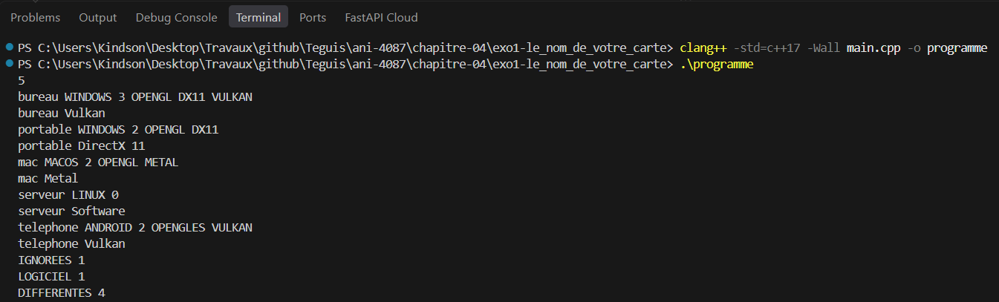
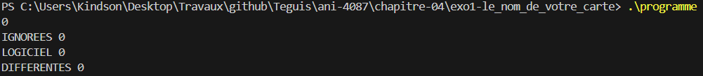

# Exercice 1 : Le nom de votre carte

## Compilation et exécution
La commande suivante nous a permis de compiler notre programme

```cmd
clang++ -std=c++17 -Wall main.cpp -o programme
```

## Entrée
Les entrées effectuées pour l'exécution, ligne par ligne

```cmd
5
bureau WINDOWS 3 OPENGL DX11 VULKAN
portable WINDOWS 2 OPENGL DX11
mac MACOS 2 OPENGL METAL
serveur LINUX 0
telephone ANDROID 2 OPENGLES VULKAN
```

## Sortie obtenue

```cmd
bureau Vulkan
portable DirectX 11
mac Metal
serveur Software
telephone Vulkan
IGNOREES 1
LOGICIEL 1
DIFFERENTES 4
```

## Détail par machine

| Machine | Plateforme | Interfaces disponibles | Choix | Remarque |
|---|---|---|---|---|
| bureau | WINDOWS | OPENGL, DX11, VULKAN | Vulkan | Premier de l'ordre de la plateforme |
| portable | WINDOWS | OPENGL, DX11 | DirectX 11 | VULKAN et DX12 sont absents |
| mac | MACOS | OPENGL, METAL | Metal | METAL passe avant OPENGL |
| serveur | LINUX | aucune | Software | Repli sur le rendu logiciel |
| telephone | ANDROID | OPENGLES, VULKAN | Vulkan | OPENGLES est ignoré |

La capture d'écran suivante présente la preuve de la compilation réussie et des résultats d'exécution présentés :


## Bilan

- `IGNOREES` affiche la valeur 1, ce qui s'explique par le fait qu'OPENGLES n'est pas dans l'ordre d'Android.
- `LOGICIEL` a pour valeur 1, car le serveur finit sur Software.
- `DIFFERENTES` affiche la valeur 4, correspondant à Vulkan, DirectX 11, Metal et Software.

## Cas limite testé
Nous avons testé le programme avec un cas limite, en entrant la valeur 0 au début. Le résultat obtenu est le suivant :

