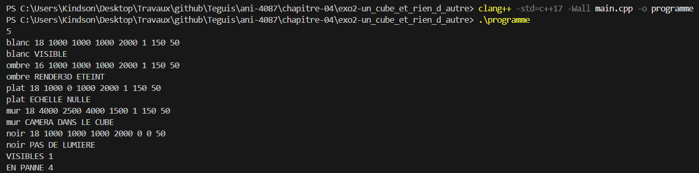
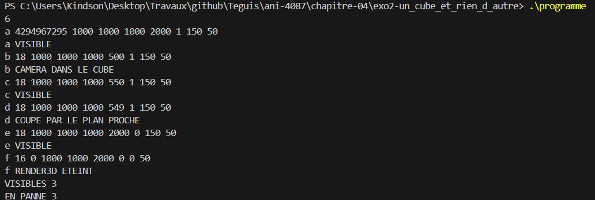
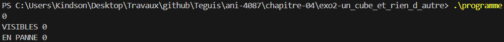

# Exercice 2 : Un cube et rien d'autre

## Compilation et exécution
La commande suivante nous a permis de compiler notre programme

```cmd
clang++ -std=c++17 -Wall main.cpp -o programme
```

## Entrée
Les entrées effectuées pour l'exécution de l'exemple de l'énoncé, ligne par ligne

```cmd
5
blanc 18 1000 1000 1000 2000 1 150 50
ombre 16 1000 1000 1000 2000 1 150 50
plat 18 1000 0 1000 2000 1 150 50
mur 18 4000 2500 4000 1500 1 150 50
noir 18 1000 1000 1000 2000 0 0 50
```

## Sortie obtenue

```cmd
blanc VISIBLE
ombre RENDER3D ETEINT
plat ECHELLE NULLE
mur CAMERA DANS LE CUBE
noir PAS DE LUMIERE
VISIBLES 1
EN PANNE 4
```

## Détail par cube

| Cube | Test qui s'applique | Verdict | Remarque |
|---|---|---|---|
| blanc | Aucun défaut | VISIBLE | Face avant à 2000 − 500 = 1500, au-delà du plan rapproché de 50 |
| ombre | `16 & 2` vaut 0 | RENDER3D ETEINT | Les ombres seules n'ont rien à ombrer |
| plat | `sy` vaut 0 | ECHELLE NULLE | Une taille nulle suffit |
| mur | Face avant à 1500 − 2000 = −500 | CAMERA DANS LE CUBE | La caméra est à l'intérieur du cube |
| noir | `lumieres` et `ambiante` valent 0 | PAS DE LUMIERE | Ni lumière ni ambiante |

La capture d'écran suivante présente la preuve de la compilation réussie et des résultats d'exécution présentés :


## Bilan

- `VISIBLES` affiche la valeur 1, car seul le cube `blanc` ne présente aucun défaut.
- `EN PANNE` affiche la valeur 4, correspondant à `ombre`, `plat`, `mur` et `noir`.

## Cas limites testés
Nous avons testé le programme avec des cas limites, en entrant les valeurs suivantes :

```cmd
6
a 4294967295 1000 1000 1000 2000 1 150 50
b 18 1000 1000 1000 500 1 150 50
c 18 1000 1000 1000 550 1 150 50
d 18 1000 1000 1000 549 1 150 50
e 18 1000 1000 1000 2000 0 150 50
f 16 0 1000 1000 2000 0 0 50
```

Le résultat obtenu est le suivant :

```cmd
a VISIBLE
b CAMERA DANS LE CUBE
c VISIBLE
d COUPE PAR LE PLAN PROCHE
e VISIBLE
f RENDER3D ETEINT
VISIBLES 3
EN PANNE 3
```

| Cube | Ce qui est testé | Verdict |
|---|---|---|
| a | `drapeaux` vaut 4294967295 et tient dans un `long long` | VISIBLE |
| b | Face avant à 500 − 500 = 0, ce qui compte comme caméra dans le cube | CAMERA DANS LE CUBE |
| c | Face avant à 50, exactement égale au plan rapproché (test strict) | VISIBLE |
| d | Face avant à 49, juste en dessous du plan rapproché | COUPE PAR LE PLAN PROCHE |
| e | Aucune lumière, mais une ambiante de 150 qui suffit | VISIBLE |
| f | Trois défauts à la fois, seul le premier dans l'ordre s'affiche | RENDER3D ETEINT |



## Cas sans aucun cube
Nous avons aussi testé le programme avec la valeur 0 au début, c'est-à-dire sans aucun cube. Le résultat obtenu est le suivant :

