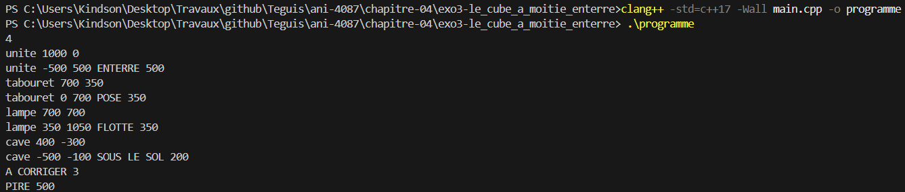
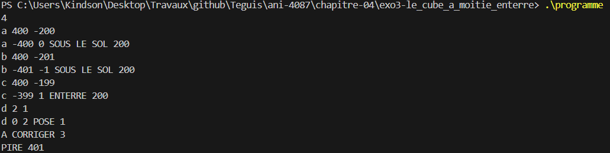

# Exercice 3 : Le cube à moitié enterré

## Compilation et exécution
La commande suivante nous a permis de compiler notre programme

```cmd
clang++ -std=c++17 -Wall main.cpp -o programme
```

## Entrée
Les entrées effectuées pour l'exécution de l'exemple de l'énoncé, ligne par ligne

```cmd
4
unite 1000 0
tabouret 700 350
lampe 700 700
cave 400 -300
```

## Sortie obtenue

```cmd
unite -500 500 ENTERRE 500
tabouret 0 700 POSE 350
lampe 350 1050 FLOTTE 350
cave -500 -100 SOUS LE SOL 200
A CORRIGER 3
PIRE 500
```

## Détail par cube

| Cube | Bas | Haut | Verdict | Hauteur de pose | Remarque |
|---|---|---|---|---|---|
| unite | −500 | 500 | ENTERRE | 500 | La moitié du cube est sous le sol |
| tabouret | 0 | 700 | POSE | 350 | Le bas touche exactement le sol |
| lampe | 350 | 1050 | FLOTTE | 350 | Flotte de 35 centimètres : on a confondu hauteur et demi-hauteur |
| cave | −500 | −100 | SOUS LE SOL | 200 | Le haut est négatif : le cube entier est sous le sol |

La capture d'écran suivante présente la preuve de la compilation réussie et des résultats d'exécution présentés :


## Bilan

- `A CORRIGER` affiche la valeur 3, car `unite`, `lampe` et `cave` n'ont pas le verdict `POSE`.
- `PIRE` affiche la valeur 500, car c'est la plus grande distance entre un bas et le sol (celle de `unite` et de `cave`).

## Cas limites testés
Nous avons testé le programme avec des cas limites, en entrant les valeurs suivantes :

```cmd
4
a 400 -200
b 400 -201
c 400 -199
d 2 1
```

Le résultat obtenu est le suivant :

```cmd
a -400 0 SOUS LE SOL 200
b -401 -1 SOUS LE SOL 200
c -399 1 ENTERRE 200
d 0 2 POSE 1
A CORRIGER 3
PIRE 401
```

| Cube | Ce qui est testé | Verdict |
|---|---|---|
| a | Le haut est exactement à 0 : le cube est entièrement dessous, donc `SOUS LE SOL` est testé avant `ENTERRE` | SOUS LE SOL |
| b | Le bas est à −401, ce qui donne la plus grande distance au sol (`PIRE` = 401) | SOUS LE SOL |
| c | Le haut est à 1, juste au-dessus du sol : le cube est coupé par le sol | ENTERRE |
| d | Le plus petit cube possible (échelle 2), posé exactement au sol | POSE |

