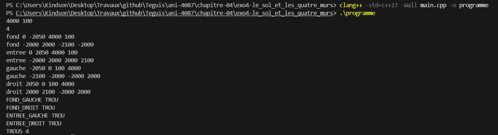

# Exercice 4 : Le sol et les quatre murs

## Compilation et exécution
La commande suivante nous a permis de compiler notre programme

```cmd
clang++ -std=c++17 -Wall main.cpp -o programme
```

## Entrée
Les entrées effectuées pour l'exécution de l'exemple de l'énoncé, ligne par ligne

```cmd
4000 100
4
fond 0 -2050 4000 100
entree 0 2050 4000 100
gauche -2050 0 100 4000
droit 2050 0 100 4000
```

## Sortie obtenue

```cmd
fond -2000 2000 -2100 -2000
entree -2000 2000 2000 2100
gauche -2100 -2000 -2000 2000
droit 2000 2100 -2000 2000
FOND_GAUCHE TROU
FOND_DROIT TROU
ENTREE_GAUCHE TROU
ENTREE_DROIT TROU
TROUS 4
```

## Détail par mur

Avec `L = 4000`, le sol va de −2000 à 2000 sur les deux axes. L'emprise d'un mur va de `cx - sx / 2` à `cx + sx / 2` en x, et de `cz - sz / 2` à `cz + sz / 2` en z.

| Mur | Centre (cx, cz) | Taille (sx, sz) | xmin | xmax | zmin | zmax |
|---|---|---|---|---|---|---|
| fond | (0, −2050) | (4000, 100) | −2000 | 2000 | −2100 | −2000 |
| entree | (0, 2050) | (4000, 100) | −2000 | 2000 | 2000 | 2100 |
| gauche | (−2050, 0) | (100, 4000) | −2100 | −2000 | −2000 | 2000 |
| droit | (2050, 0) | (100, 4000) | 2000 | 2100 | −2000 | 2000 |

## Détail par angle

Avec `h = L / 2 = 2000` et `e = 100`, chaque angle est un carré de côté 100 juste à l'extérieur du sol.

| Angle | Carré en x | Carré en z | Verdict | Remarque |
|---|---|---|---|---|
| FOND_GAUCHE | −2100 à −2000 | −2100 à −2000 | TROU | `fond` s'arrête à −2000 en x, `gauche` s'arrête à −2000 en z |
| FOND_DROIT | 2000 à 2100 | −2100 à −2000 | TROU | `fond` s'arrête à 2000 en x, `droit` s'arrête à −2000 en z |
| ENTREE_GAUCHE | −2100 à −2000 | 2000 à 2100 | TROU | `entree` s'arrête à −2000 en x, `gauche` s'arrête à 2000 en z |
| ENTREE_DROIT | 2000 à 2100 | 2000 à 2100 | TROU | `entree` s'arrête à 2000 en x, `droit` s'arrête à 2000 en z |

Aucun mur ne contient à lui seul le carré d'un angle, chaque mur le touche par un bord sans le couvrir entièrement.

La capture d'écran suivante présente la preuve de la compilation réussie et des résultats d'exécution présentés :


## Bilan

- `TROUS` affiche la valeur 4, car les quatre angles sont des trous.
- Pour les boucher, il suffirait d'allonger `fond` et `entree` de deux épaisseurs (`sx` à 4200) : chacun couvrirait alors entièrement les carrés des angles voisins.