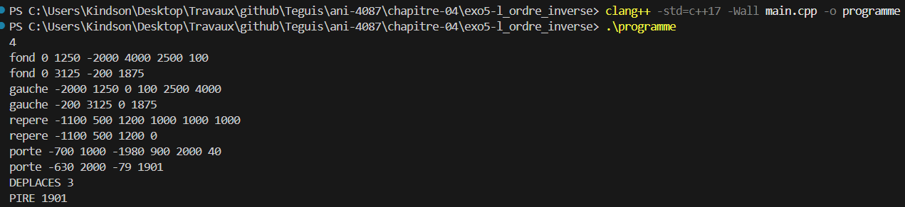
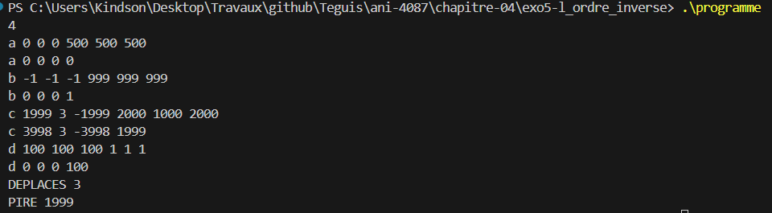

# Exercice 5 : L'ordre inversé

## Compilation et exécution
La commande suivante nous a permis de compiler notre programme

```cmd
clang++ -std=c++17 -Wall main.cpp -o programme
```

## Entrée
Les entrées effectuées pour l'exécution de l'exemple de l'énoncé, ligne par ligne

```cmd
4
fond 0 1250 -2000 4000 2500 100
gauche -2000 1250 0 100 2500 4000
repere -1100 500 1200 1000 1000 1000
porte -700 1000 -1980 900 2000 40
```

## Sortie obtenue

```cmd
fond 0 3125 -200 1875
gauche -200 3125 0 1875
repere -1100 500 1200 0
porte -630 2000 -79 1901
DEPLACES 3
PIRE 1901
```

## Détail par objet

Avec le mauvais ordre (échelle puis translation), chaque composante de la translation est multipliée par l'échelle de son propre axe : `x = sx * tx / 1000`, `y = sy * ty / 1000`, `z = sz * tz / 1000`. La division est entière et tronquée vers zéro.

| Objet | Bonne position (tx, ty, tz) | Mauvaise position (x, y, z) | Écart | Remarque |
|---|---|---|---|---|
| fond | (0, 1250, −2000) | (0, 3125, −200) | 1875 | L'écart en y vaut 1875, celui en z 1800 : on garde le plus grand |
| gauche | (−2000, 1250, 0) | (−200, 3125, 0) | 1875 | Le même mur tourné |
| repere | (−1100, 500, 1200) | (−1100, 500, 1200) | 0 | Échelle 1000 sur les trois axes : les deux ordres donnent le même résultat |
| porte | (−700, 1000, −1980) | (−630, 2000, −79) | 1901 | En z, 40 × (−1980) / 1000 = −79,2 tronqué à −79 |

La capture d'écran suivante présente la preuve de la compilation réussie et des résultats d'exécution présentés :


## Bilan

- `DEPLACES` affiche la valeur 3, car `fond`, `gauche` et `porte` ont un écart non nul.
- `PIRE` affiche la valeur 1901, qui correspond à l'écart en z de la porte.

## Cas limites testés
Nous avons testé le programme avec des cas limites, en entrant les valeurs suivantes :

```cmd
4
a 0 0 0 500 500 500
b -1 -1 -1 999 999 999
c 1999 3 -1999 2000 1000 2000
d 100 100 100 1 1 1
```

Le résultat obtenu est le suivant :

```cmd
a 0 0 0 0
b 0 0 0 1
c 3998 3 -3998 1999
d 0 0 0 100
DEPLACES 3
PIRE 1999
```

| Objet | Ce qui est testé | Résultat |
|---|---|---|
| a | Translation nulle : aucun déplacement même avec une échelle différente de 1000 | Écart 0 |
| b | −0,999 est tronqué vers zéro, donc à 0 et non à −1 | Écart 1 |
| c | Échelle 1000 en y : l'axe y ne bouge pas, seuls x et z sont déplacés | Écart 1999 |
| d | 100 × 1 / 1000 donne 0 : on multiplie avant de diviser | Écart 100 |

