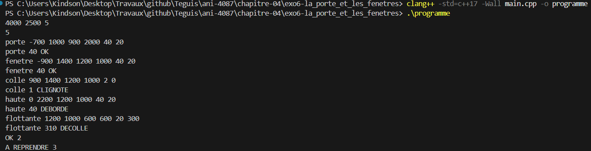
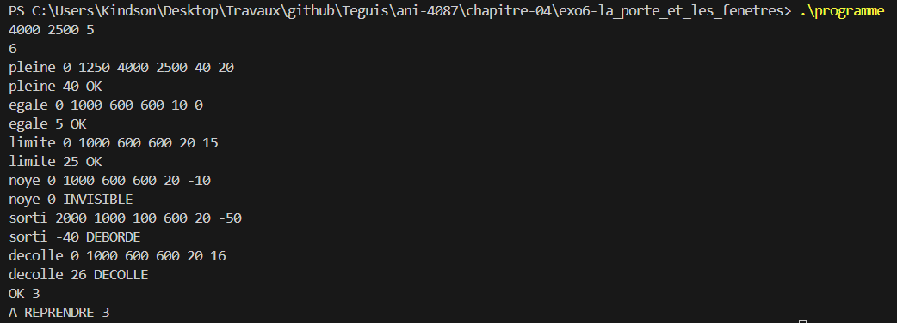

# Exercice 6 : La porte et les fenêtres

## Compilation et exécution
La commande suivante nous a permis de compiler notre programme

```cmd
clang++ -std=c++17 -Wall main.cpp -o programme
```

## Entrée
Les entrées effectuées pour l'exécution de l'exemple de l'énoncé, ligne par ligne

```cmd
4000 2500 5
5
porte -700 1000 900 2000 40 20
fenetre -900 1400 1200 1000 40 20
colle 900 1400 1200 1000 2 0
haute 0 2200 1200 1000 40 20
flottante 1200 1000 600 600 20 300
```

## Sortie obtenue

```cmd
porte 40 OK
fenetre 40 OK
colle 1 CLIGNOTE
haute 40 DEBORDE
flottante 310 DECOLLE
OK 2
A REPRENDRE 3
```

## Détail par panneau

Le mur va de −2000 à 2000 en largeur et de 0 à 2500 en hauteur, avec un seuil de 5 millimètres. La saillie vaut `d + e / 2` (face avant) et la face arrière `d - e / 2`. Les verdicts sont testés dans l'ordre : `DEBORDE`, `INVISIBLE`, `CLIGNOTE`, `DECOLLE`, puis `OK`.

| Panneau | Largeur | Hauteur | Saillie | Face arrière | Verdict | Remarque |
|---|---|---|---|---|---|---|
| porte | −1150 à −250 | 0 à 2000 | 40 | 0 | OK | Tient dans le mur et est collée contre lui |
| fenetre | −1500 à −300 | 900 à 1900 | 40 | 0 | OK | Même profondeur que la porte |
| colle | 300 à 1500 | 900 à 1900 | 1 | −1 | CLIGNOTE | Saillie de 1 inférieure au seuil de 5 |
| haute | −600 à 600 | 1700 à 2700 | 40 | 0 | DEBORDE | Le haut est à 2700, au-dessus des 2500 du mur |
| flottante | 900 à 1500 | 700 à 1300 | 310 | 290 | DECOLLE | Face arrière à 290, bien au-delà du seuil |

La capture d'écran suivante présente la preuve de la compilation réussie et des résultats d'exécution présentés :


## Bilan

- `OK` affiche la valeur 2, car `porte` et `fenetre` sont justes.
- `A REPRENDRE` affiche la valeur 3, correspondant à `colle`, `haute` et `flottante`.

## Cas limites testés
Nous avons testé le programme avec des cas limites, en entrant les valeurs suivantes :

```cmd
4000 2500 5
6
pleine 0 1250 4000 2500 40 20
egale 0 1000 600 600 10 0
limite 0 1000 600 600 20 15
noye 0 1000 600 600 20 -10
sorti 2000 1000 100 600 20 -50
decolle 0 1000 600 600 20 16
```

Le résultat obtenu est le suivant :

```cmd
pleine 40 OK
egale 5 OK
limite 25 OK
noye 0 INVISIBLE
sorti -40 DEBORDE
decolle 26 DECOLLE
OK 3
A REPRENDRE 3
```

| Panneau | Ce qui est testé | Verdict |
|---|---|---|
| pleine | Panneau exactement de la taille du mur : les bords coïncident, il ne déborde pas | OK |
| egale | Saillie égale au seuil (5) : elle ne clignote pas | OK |
| limite | Face arrière exactement au seuil (5) : elle ne décolle pas | OK |
| noye | Saillie nulle (0) : le panneau est noyé dans le mur | INVISIBLE |
| sorti | Le bord droit est à 2050, au-delà de 2000, et la saillie négative (−40) s'affiche quand même | DEBORDE |
| decolle | Face arrière à 6, juste au-dessus du seuil | DECOLLE |

