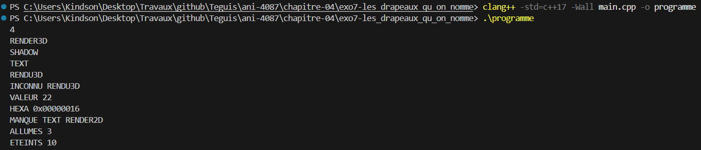
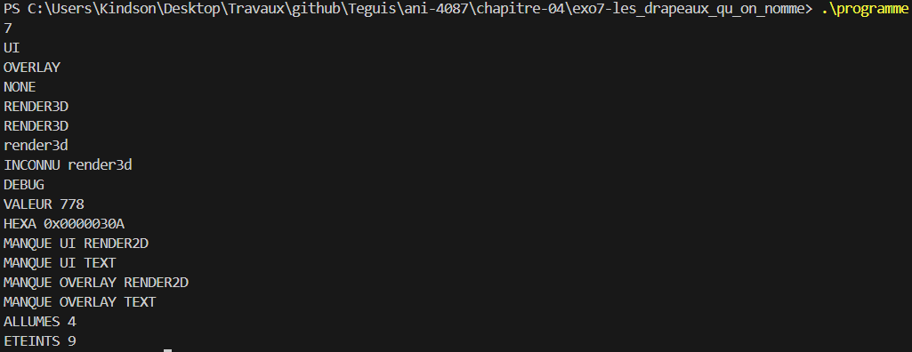

# Exercice 7 : Les drapeaux qu'on nomme

## Compilation et exécution
La commande suivante nous a permis de compiler notre programme, sans aucun avertissement

```cmd
clang++ -std=c++17 -Wall main.cpp -o programme
```

## Entrée
Les entrées effectuées pour l'exécution de l'exemple de l'énoncé, ligne par ligne

```cmd
4
RENDER3D
SHADOW
TEXT
RENDU3D
```

## Sortie obtenue

```cmd
INCONNU RENDU3D
VALEUR 22
HEXA 0x00000016
MANQUE TEXT RENDER2D
ALLUMES 3
ETEINTS 10
```

## Détail par nom lu

| Nom lu | Statut | Valeur | Remarque |
|---|---|---|---|
| RENDER3D | Reconnu | 2 | Combiné à la valeur par un OU binaire |
| SHADOW | Reconnu | 16 | Dépend de RENDER3D, qui est bien allumé |
| TEXT | Reconnu | 4 | Dépend de RENDER2D, qui n'est pas allumé |
| RENDU3D | Inconnu | / | Faute de frappe : signalé par `INCONNU`, mais la valeur ne change pas |

La valeur finale vaut 2 \| 16 \| 4 = 22, soit `0x00000016` sur huit chiffres hexadécimaux.

La capture d'écran suivante présente la preuve de la compilation réussie et des résultats d'exécution présentés :


## Bilan

- `INCONNU RENDU3D` signale la faute de frappe, sans interrompre le programme.
- `MANQUE TEXT RENDER2D` indique que `TEXT` est allumé alors que sa dépendance `RENDER2D` ne l'est pas.
- `ALLUMES` affiche la valeur 3 (`RENDER3D`, `TEXT` et `SHADOW`), et `ETEINTS` la valeur 10, soit 13 moins 3.

## Cas limite testé
Ce cas limite regroupe plusieurs pièges de l'énoncé dans une seule exécution. Il permet de voir et de comprendre cinq choses :

- **La casse compte.** `render3d` en minuscules n'est pas `RENDER3D` : le nom est inconnu, il est signalé et n'ajoute rien à la valeur.
- **Un nom répété ne change rien.** `RENDER3D` est lu deux fois, mais le OU binaire ne l'ajoute qu'une fois. Avec une addition, il aurait été compté deux fois et la valeur aurait été fausse.
- **`NONE` est un nom connu.** Il ne produit pas de ligne `INCONNU` et n'ajoute rien, car sa valeur est 0.
- **Un composé contient plusieurs drapeaux.** `DEBUG` vaut `OVERLAY | SIMULATION` : il allume `SIMULATION` et rallume `OVERLAY`, déjà présent, sans le compter deux fois. Il compte donc pour deux drapeaux simples dans `ALLUMES`, dont un seul est nouveau.
- **Les dépendances se lisent dans l'ordre imposé.** `UI` et `OVERLAY` sont allumés sans `RENDER2D` ni `TEXT` : les lignes `MANQUE` sortent d'abord pour `UI`, puis pour `OVERLAY`, chacune avec ses dépendances dans l'ordre donné par l'énoncé.

Les entrées effectuées sont les suivantes :

```cmd
7
UI
OVERLAY
NONE
RENDER3D
RENDER3D
render3d
DEBUG
```

Le résultat obtenu est le suivant :

```cmd
INCONNU render3d
VALEUR 778
HEXA 0x0000030A
MANQUE UI RENDER2D
MANQUE UI TEXT
MANQUE OVERLAY RENDER2D
MANQUE OVERLAY TEXT
ALLUMES 4
ETEINTS 9
```

| Nom lu | Statut | Valeur | Remarque |
|---|---|---|---|
| UI | Reconnu | 8 | Dépend de RENDER2D et TEXT, tous deux éteints |
| OVERLAY | Reconnu | 256 | Dépend de RENDER2D et TEXT, tous deux éteints |
| NONE | Reconnu | 0 | N'ajoute rien et ne produit pas de ligne `INCONNU` |
| RENDER3D | Reconnu | 2 | Allumé |
| RENDER3D | Reconnu | 2 | Répété : le OU binaire ne l'ajoute pas une seconde fois |
| render3d | Inconnu | / | Minuscules : la casse compte, donc signalé par `INCONNU` |
| DEBUG | Reconnu | 768 | Composé de OVERLAY (256) et SIMULATION (512) |

La valeur finale vaut 8 \| 256 \| 0 \| 2 \| 768 = 778, soit `0x0000030A` en hexadécimal. Les quatre drapeaux simples allumés sont `UI`, `RENDER3D`, `OVERLAY` et `SIMULATION`, d'où `ALLUMES 4` et `ETEINTS 9`.

